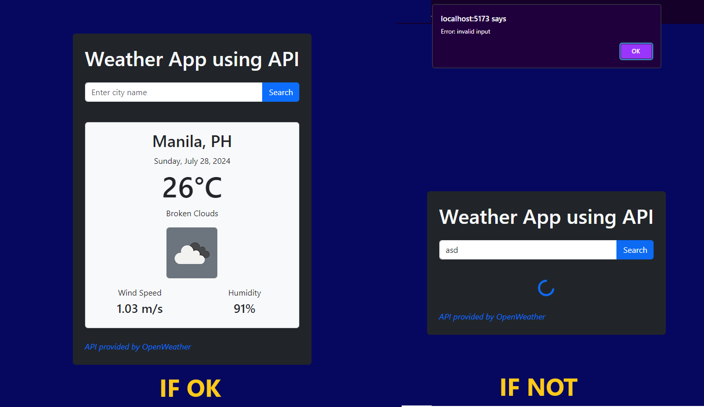

# React Weather using OpenWeather API

This project is a simple weather application built using React and the OpenWeather API. It allows users to search for and view the current weather conditions in any city around the world.

## Technologies Used

- **React**: JavaScript library for building user interfaces.
- **Bootstrap**: CSS framework.
- **OpenWeather API**: For fetching data base on user input.

## Demo

## About

These exercises show my eagerness to learn and improve my programming skills. Each one is a step towards mastering new concepts and tools in React.
